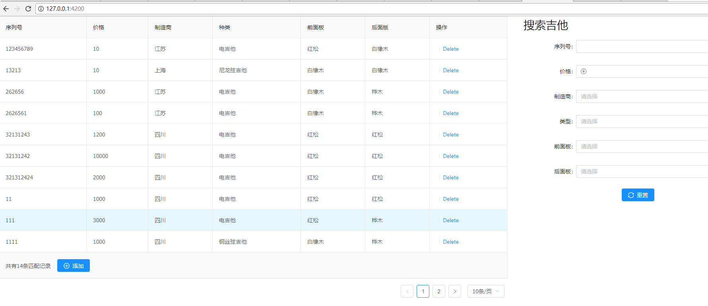
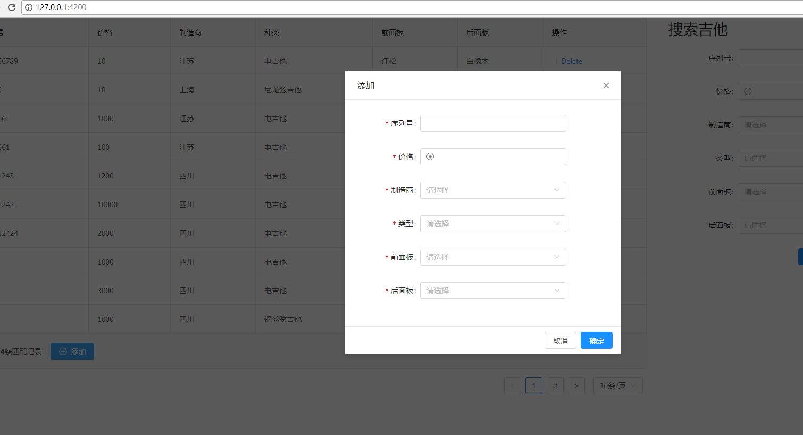
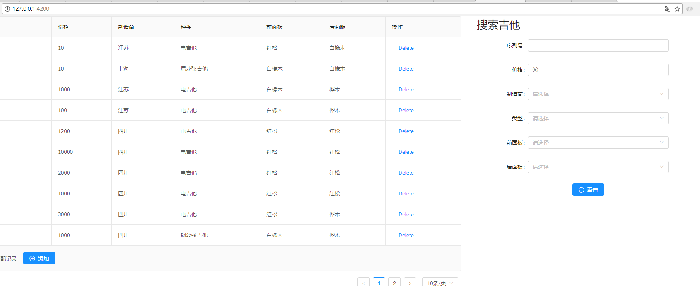

# Guitar base on OOAD

项目架构：SpringBoot+JPA+(SQLite|MySql)+Angular6.0

## 使用方法
后端位于/guitar目录，基于maven构建，直接导入就好。注意如果使用IDEA在根目录打开，sqlite连接url要有后端根目录名，直接打开后端所在目录则不用。

前端位于/front目录，基于angular6+ng-zorro-antd
```bash
 npm i
 npm start
```
## 切换数据库
更改`application.properties`的`spring.profiles.active=sqlite||mysql`


### 运行主界面

### 添加实体

### 查询
